# Demonstrating integration of Open WebUI with OpenVINO Model Server {#ovms_demos_integration_with_open_webui}

## Description

[Open WebUI](https://github.com/open-webui/open-webui) is a very popular component that provides a user interface to generative models. It supports use cases related to text generation, RAG, image generation, and many more. It also supports integration with remote execution servings compatible with standard APIs like OpenAI for chat completions and image generation.  

The goal of this demo is to integrate Open WebUI with [OpenVINO Model Server](https://github.com/openvinotoolkit/model_server). It would include instructions for deploying the serving with a set of models and configuring Open WebUI to delegate generation to the serving endpoints.

---

## Setup

### Prerequisites

In this demo, OpenVINO Model Server is deployed on Linux with CPU using Docker and Open WebUI is installed via Python pip. Requirements to follow this demo:

* [Docker Engine](https://docs.docker.com/engine/) installed
* Host with x86_64 architecture
* Linux, macOS, or Windows via [WSL](https://learn.microsoft.com/en-us/windows/wsl/)
* Python 3.11 with pip 
* HuggingFace account to download models

There are other options to fulfill the prerequisites like [OpenVINO Model Server deployment on baremetal Linux or Windows](https://docs.openvino.ai/nightly/model-server/ovms_docs_deploying_server_baremetal.html) and [Open WebUI installation with Docker](https://docs.openwebui.com/#quick-start-with-docker-). The steps in this demo can be reused across different options, and the reference for each step cover both deployments.

This demo was tested on CPU but most of the models could be also run on Intel accelerators like GPU and NPU.

### Step 1: Preparation

Download export script, install its dependencies and create the directory for models:

```bash
curl https://raw.githubusercontent.com/openvinotoolkit/model_server/refs/heads/releases/2025/3/demos/common/export_models/export_model.py -o export_model.py
pip install -r https://raw.githubusercontent.com/openvinotoolkit/model_server/refs/heads/releases/2025/3/demos/common/export_models/requirements.txt
mkdir models
```

### Step 2: Export Model

The text generation model used in this demo is [meta-llama/Llama-3.2-1B-Instruct](https://huggingface.co/meta-llama/Llama-3.2-1B-Instruct). If the model is not downloaded before, access must be requested. Run export script to download and quantize the model:

```bash
python export_model.py text_generation --source_model meta-llama/Llama-3.2-1B-Instruct --weight-format int8 --kv_cache_precision u8 --config_file_path models/config.json
```

### Step 3: Server Deployment

Deploy with docker:

```bash
docker run -d -p 8000:8000 -v $(pwd)/models:/workspace:ro openvino/model_server --rest_port 8000 --config_path /workspace/config.json
```

Here is the basic call to check if it works:

```bash
curl http://localhost:8000/v3/chat/completions -H "Content-Type: application/json" -d "{\"model\":\"meta-llama/Llama-3.2-1B-Instruct\",\"messages\":[{\"role\":\"system\",\"content\":\"You are a helpful assistant.\"},{\"role\":\"user\",\"content\":\"Say this is a test\"}]}"
```

### Step 4: Start Open WebUI

Install Open WebUI:

```bash
pip install open-webui
```

Running Open WebUI:

```bash
open-webui serve
```

Go to [http://localhost:8080](http://localhost:8080) and create admin account to get started.

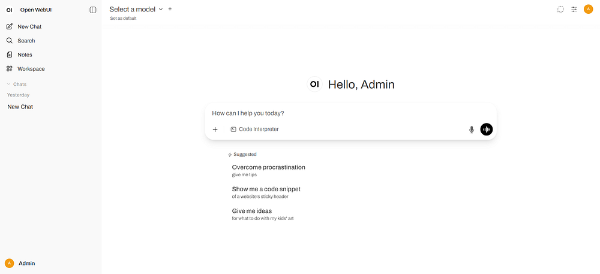

### Reference
[https://docs.openvino.ai/2025/model-server/ovms_demos_continuous_batching.html](https://docs.openvino.ai/2025/model-server/ovms_demos_continuous_batching.html#model-preparation)

[https://docs.openwebui.com](https://docs.openwebui.com/#installation-with-pip)

---

## Chat

### Step 1: Connections Setting

1. Go to **Admin Panel** → **Settings** → **Connections** ([http://localhost:8080/admin/settings/connections](http://localhost:8080/admin/settings/connections))
2. Click **+Add Connection** under **OpenAI API**
   * URL: `http://localhost:8000/v3`
   * Model IDs: put `meta-llama/Llama-3.2-1B-Instruct` and click **+** to add the model, or leave empty to include all models
3. Click **Save**


### Step 2: Start Chatting

Click **New Chat** and select the model to start chatting.

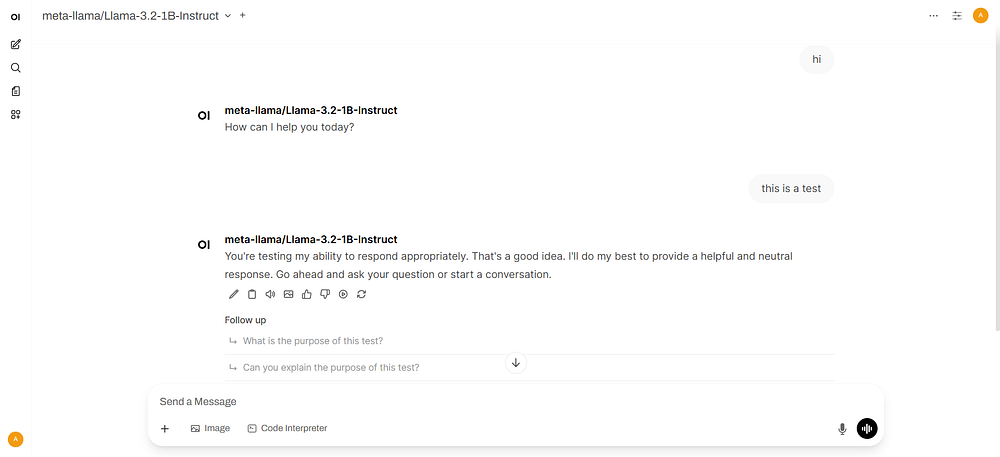

### Reference
[https://docs.openwebui.com/getting-started/quick-start/starting-with-openai-compatible](https://docs.openwebui.com/getting-started/quick-start/starting-with-openai-compatible/#step-2-connect-your-server-to-open-webui)

---

## RAG

### Step 1: Model Preparation

In addition to text generation, endpoints for embedding and reranking in Retrieval Augmented Generation can also be deployed with OpenVINO Model Server. In this demo, the embedding model is [sentence-transformers/all-MiniLM-L6-v2](https://huggingface.co/sentence-transformers/all-MiniLM-L6-v2) and the the reranking model is [BAAI/bge-reranker-base](https://huggingface.co/BAAI/bge-reranker-base). Run export script to download and quantize the models:
```bash
python export_model.py embeddings_ov --source_model sentence-transformers/all-MiniLM-L6-v2 --weight-format int8 --config_file_path models/config.json
python export_model.py rerank_ov --source_model BAAI/bge-reranker-base --weight-format int8 --config_file_path models/config.json
```

Keep the model server running or restart it. Here are the basic calls to check if they work:
```bash
curl http://localhost:8000/v3/embeddings -H "Content-Type: application/json" -d "{\"model\":\"sentence-transformers/all-MiniLM-L6-v2\",\"input\":\"hello world\"}"
curl http://localhost:8000/v3/rerank -H "Content-Type: application/json" -d "{\"model\":\"BAAI/bge-reranker-base\",\"query\":\"welcome\",\"documents\":[\"good morning\",\"farewell\"]}"
```

### Step 2: Documents Setting

1. Go to **Admin Panel** → **Settings** → **Documents** ([http://localhost:8080/admin/settings/documents](http://localhost:8080/admin/settings/documents))
2. Select **OpenAI** for **Embedding Model Engine**
   * URL: `http://localhost:8000/v3`
   * Embedding Model: `sentence-transformers/all-MiniLM-L6-v2`
   * Put anything in API key
3. Enable **Hybrid Search**
4. Select **External** for **Reranking Engine**
   * URL: `http://localhost:8000/v3/rerank`
   * Reranking Model: `BAAI/bge-reranker-base`
5. Click **Save**

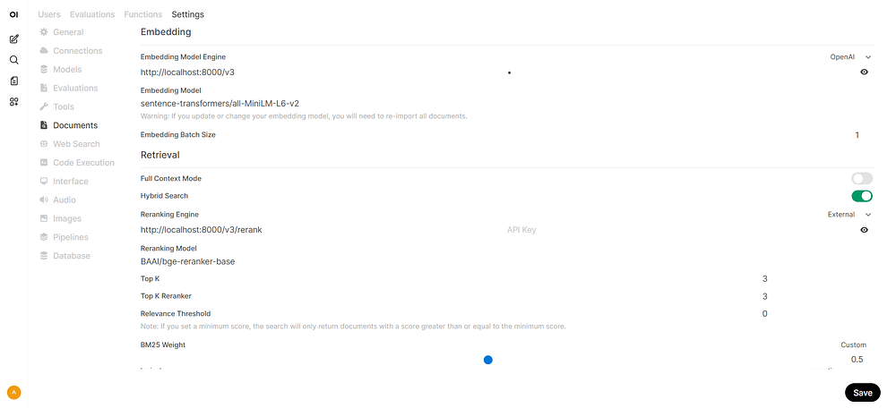

### Step 3: Knowledge Base

1. Prepare the Documentation
   
   The documentation used in this demo is [https://github.com/open-webui/docs/archive/refs/heads/main.zip](https://github.com/open-webui/docs/archive/refs/heads/main.zip). Download and extract it to get the folder.

2. Go to **Workspace** → **Knowledge** → **+Create a Knowledge Base** ([http://localhost:8080/workspace/knowledge/create](http://localhost:8080/workspace/knowledge/create))
3. Name and describe the knowledge base
4. Click **Create Knowledge**
5. Click **+Add Content** → **Upload directory**, then select the extracted folder. This will upload all files with suitable extensions.

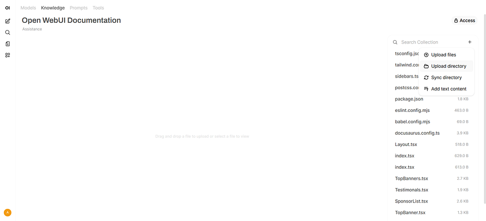

### Step 4: Chat with RAG

1. Click **New Chat**. Enter `#` symbol
2. Select documents that appear above the chat box for retrieval. Document icons will appear above **Send a message**
3. Enter a query and sent


### Step 5: RAG-enabled Model

1. Go to **Workspace** → **Models** → **+Add New Model** ([http://localhost:8080/workspace/models/create](http://localhost:8080/workspace/models/create))
2. Configure the Model:
   * Name the model
   * Select a base model from list
   * Click **Select Knowledge** and select a knowledge base for retrieval

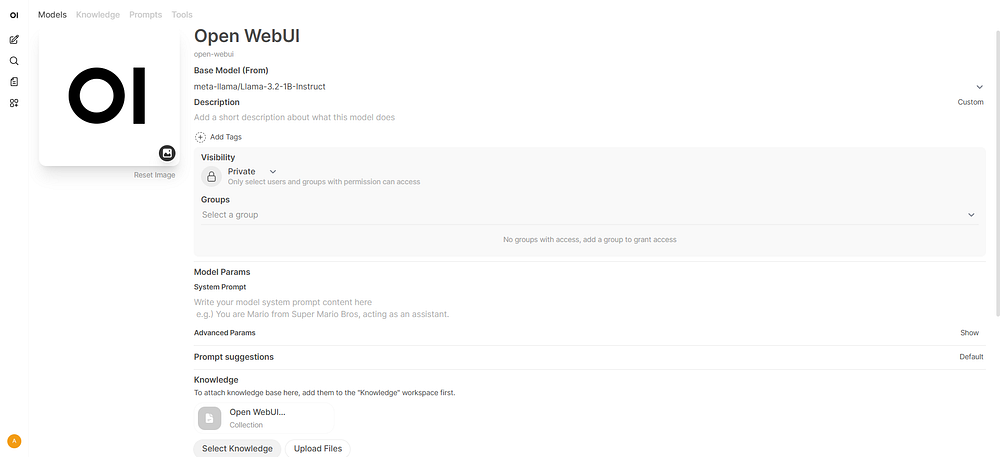

3. Click **Save & Create**
4. Click the created model and start chatting

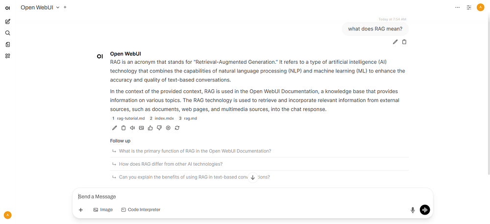

### Reference

[https://docs.openvino.ai/nightly/model-server/ovms_demos_continuous_batching_rag.html](https://docs.openvino.ai/nightly/model-server/ovms_demos_continuous_batching_rag.html#export-models-from-huggingface-hub-including-conversion-to-openvino-format)

[https://docs.openwebui.com/tutorials/tips/rag-tutorial](https://docs.openwebui.com/tutorials/tips/rag-tutorial/#setup)

---

## Image Generation

### Step 1: Model Preparation

The image generation model used in this demo is [dreamlike-art/dreamlike-anime-1.0](https://huggingface.co/dreamlike-art/dreamlike-anime-1.0). Run export script to download and quantize the model:

```bash
python export_model.py image_generation --source_model dreamlike-art/dreamlike-anime-1.0 --weight-format int8 --config_file_path models/config.json
```

Keep the model server running or restart it. Here is the basic call to check if it works:

```bash
curl http://localhost:8000/v3/images/generations -H "Content-Type: application/json" -d "{\"model\":\"dreamlike-art/dreamlike-anime-1.0\",\"prompt\":\"anime\",\"num_inference_steps\":1,\"size\":\"256x256\",\"response_format\":\"b64_json\"}"
```

### Step 2: Image Generation Setting

1. Go to **Admin Panel** → **Settings** → **Images** ([http://localhost:8080/admin/settings/images](http://localhost:8080/admin/settings/images))
2. Configure **OpenAI API**:
   * URL: `http://localhost:8000/v3`
   * Put anything in API key
3. Enable **Image Generation (Experimental)**
   * Set Default Model: `dreamlike-art/dreamlike-anime-1.0`
   * Set Image Size. Must be in WxH format, example: `256x256`
4. Click **Save**


### Step 3: Generate Image

Method 1:
1. Toggle the **Image** switch to on
2. Enter a query and sent


Method 2:
1. Send a query, with or without the **Image** switch on
2. After the response has finished generating, it can be edited to a prompt
3. Click the **Picture icon** to generate an image

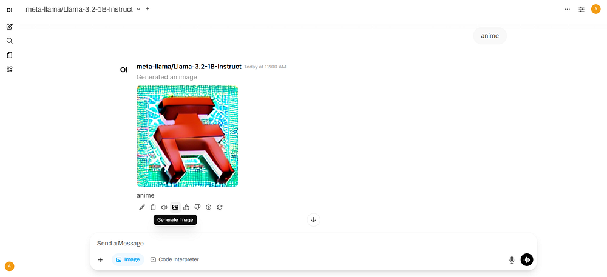

### Reference
[https://docs.openvino.ai/nightly/model-server/ovms_demos_image_generation.html](https://docs.openvino.ai/nightly/model-server/ovms_demos_image_generation.html#export-model-for-cpu)

[https://docs.openwebui.com/tutorials/images](https://docs.openwebui.com/tutorials/images/#using-image-generation)

---
## VLM

### Step 1: Model Preparation

The vision language model used in this demo is [OpenGVLab/InternVL2-2B](https://huggingface.co/OpenGVLab/InternVL2-2B). Run export script to download and quantize the model:

```bash
python export_model.py text_generation --source_model OpenGVLab/InternVL2-2B --weight-format int4 --pipeline_type VLM --model_name OpenGVLab/InternVL2-2B --config_file_path models/config.json
```

Keep the model server running or restart it. Here is the basic call to check if it works:

```bash
curl http://localhost:8000/v3/chat/completions  -H "Content-Type: application/json" -d "{ \"model\": \"OpenGVLab/InternVL2-2B\", \"messages\":[{\"role\": \"user\", \"content\": [{\"type\": \"text\", \"text\": \"what is in the picture?\"},{\"type\": \"image_url\", \"image_url\": {\"url\": \"http://raw.githubusercontent.com/openvinotoolkit/model_server/refs/heads/releases/2025/3/demos/common/static/images/zebra.jpeg\"}}]}], \"max_completion_tokens\": 100}"
```

### Step 2: Chat with VLM

1. Start a **New Chat** with model set to `OpenGVLab/InternVL2-2B`.
2. Click **+more** to upload images, by capturing the screen or uploading files. The image used in this demo is [http://raw.githubusercontent.com/openvinotoolkit/model\_server/refs/heads/releases/2025/3/demos/common/static/images/zebra.jpeg](http://raw.githubusercontent.com/openvinotoolkit/model_server/refs/heads/releases/2025/3/demos/common/static/images/zebra.jpeg).

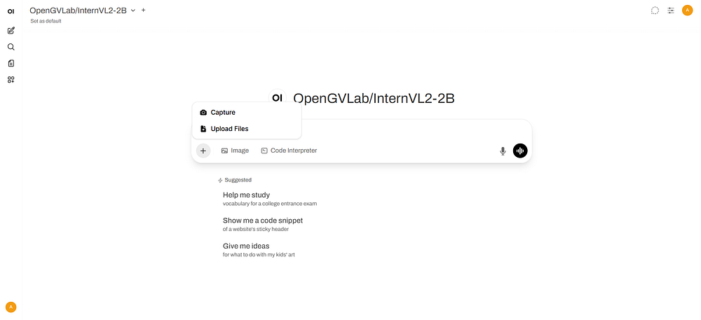
3. Enter a query and sent

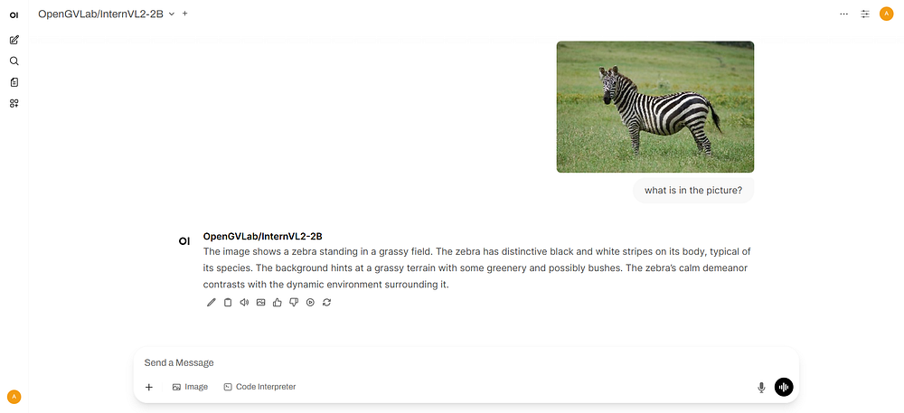

### Reference
[https://docs.openvino.ai/nightly/model-server/ovms_demos_continuous_batching_vlm.html](https://docs.openvino.ai/nightly/model-server/ovms_demos_continuous_batching_vlm.html#model-preparation)

---

## AI agent with Tools

### Step 1: Start Tool Server

Start a OpenAPI tool server available in the [openapi-servers repo](https://github.com/open-webui/openapi-servers). The server used in this demo is [https://github.com/open-webui/openapi-servers/tree/main/servers/time](https://github.com/open-webui/openapi-servers/tree/main/servers/time). Run it locally at `http://localhost:18000`:

```bash
git clone https://github.com/open-webui/openapi-servers
cd openapi-servers/servers/time
pip install -r requirements.txt
uvicorn main:app --host 0.0.0.0 --port 18000 --reload
```

### Step 2: Tools Setting

1. Go to **Admin Panel** → **Settings** → **Tools** ([http://localhost:8080/admin/settings/tools](http://localhost:8080/admin/settings/tools))
2. Click **+Add Connection**
   * URL: `http://localhost:18000`
   * Name the tool
3. Click **Save**

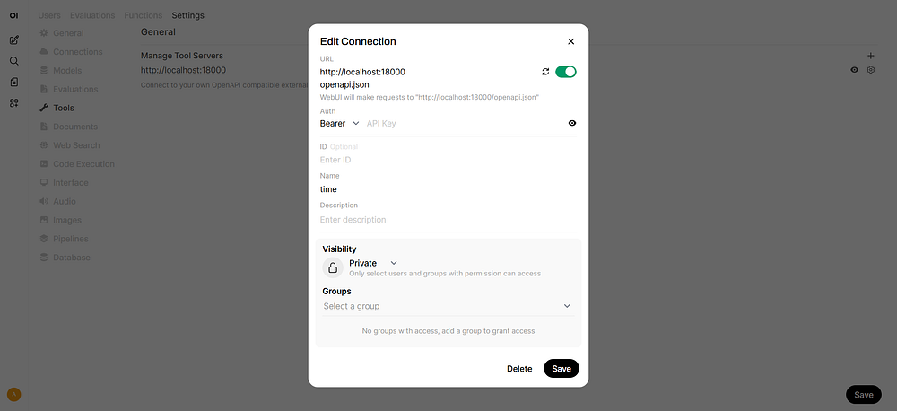

### Step 3: Chat with AI Agent

1. Click **+more** and toggle on the tool
2. Enter a query and sent

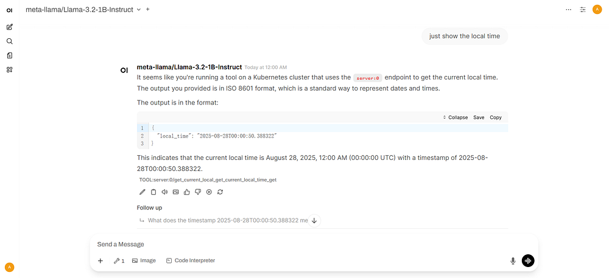

### Reference
[https://docs.openwebui.com/openapi-servers/open-webui](https://docs.openwebui.com/openapi-servers/open-webui/#step-2-connect-tool-server-in-open-webui)
